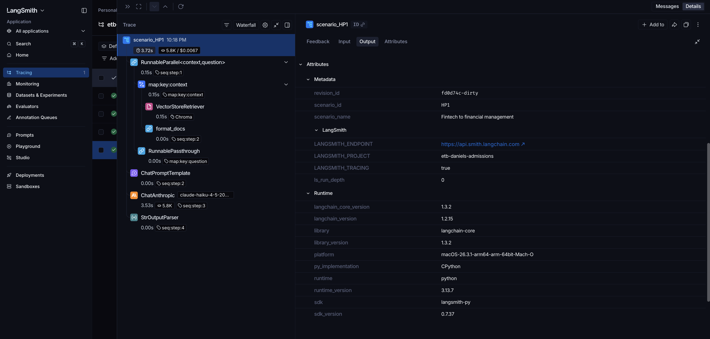
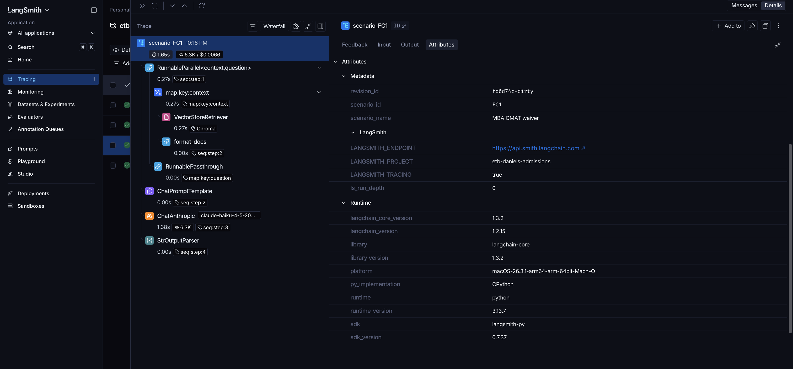
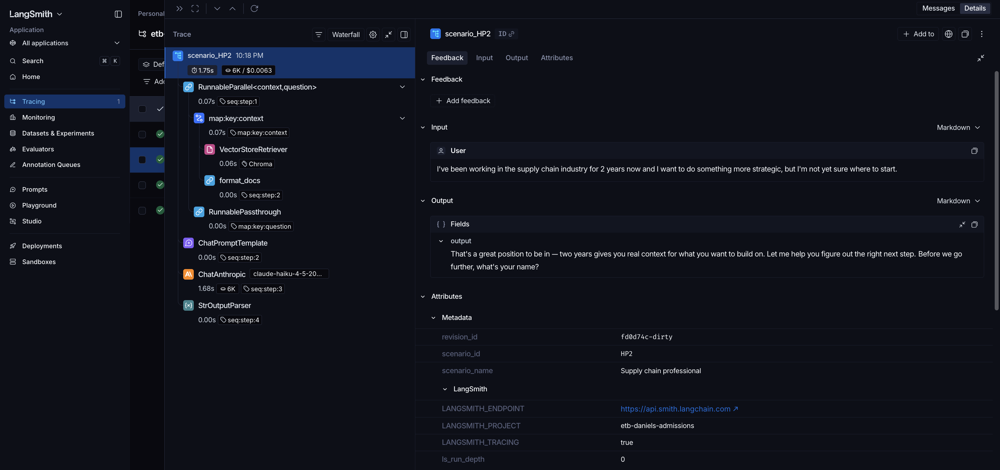
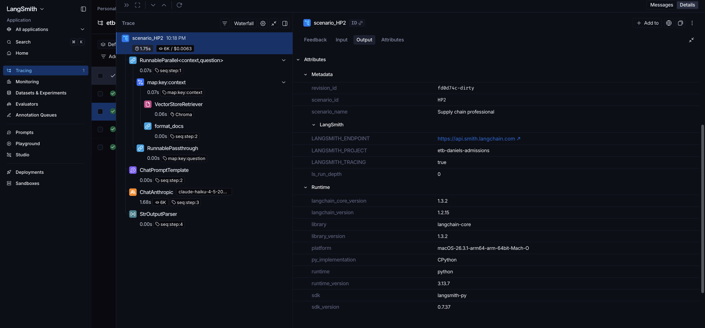
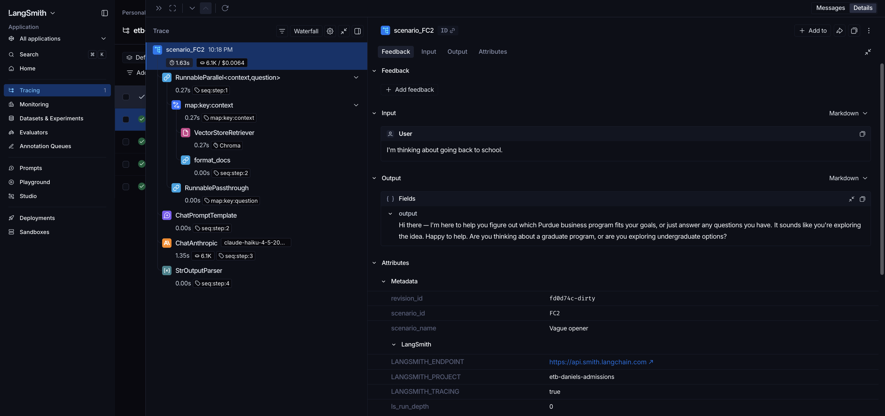
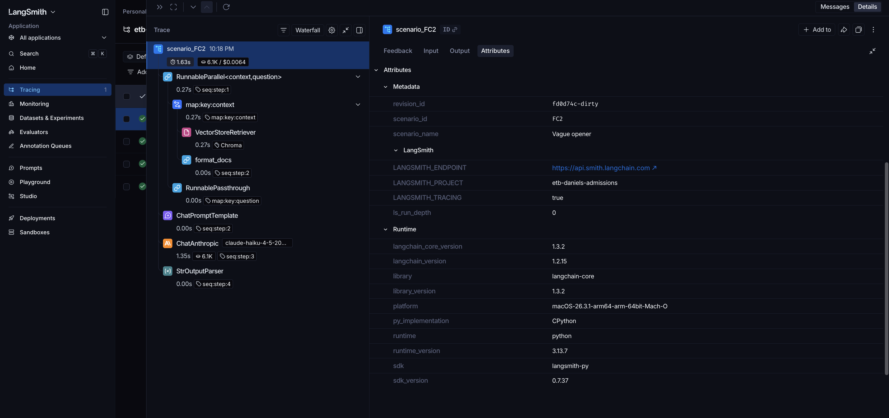

# LangSmith Traces — Evidence

Real LangSmith traces captured from running the 4 evaluation scenarios through the [LangSmith pipeline](../langsmith_pipeline/) on **April 26, 2026**.

These screenshots demonstrate end-to-end observability: every retrieval, prompt, LLM call, latency measurement, and token count is captured by LangSmith.

---

## Live LangSmith dashboard

The live LangSmith project is at https://smith.langchain.com → Projects → `etb-daniels-admissions` (private to my workspace).

The screenshots and JSON exports below are the externally-shareable equivalent.

---

## Scenario HP1 — Fintech professional → financial management

**Input:** *"I have 3 years of work experience in fintech and now I want to move into financial management as it is in high demand. What programs should I look for?"*

**Expected behavior:** Recommend MSF; mention top employers (Goldman, JP Morgan, Capital One); ask the full-time vs. online slot-filling question.

### Trace — Input & Output


The left panel shows the full LangChain run tree: `RunnableParallel` → `map:key:context` → `VectorStoreRetriever` (Chroma) + `format_docs` → `RunnablePassthrough` → `ChatPromptTemplate` → `ChatAnthropic` (Claude Haiku 4.5, ~3.7s, ~5.4k tokens, ~$0.0007) → `StrOutputParser`. The right panel shows the input question and the agent's full response — recommending MSF as predicted.

### Trace — Metadata & Runtime


The Attributes tab shows the scenario metadata I attached at invocation time (`scenario_id: HP1`, `scenario_name: Fintech to financial management`), the LangSmith project binding (`etb-daniels-admissions`), and full runtime context (Python 3.13, LangSmith Python SDK, Mac M-series).

---

## Scenario FC1 — MBA GMAT waiver (recovered failure case)

**Input:** *"Does the MBA program waive the GMAT requirements?"*

**Expected behavior:** Mention BOTH MBA programs (One-Year vs. Online), explain STEM-degree path for One-Year and automatic 3-year-experience waiver for Online, and ask which program the user means.

### Trace — Input & Output


The agent correctly identifies the ambiguity ("clarify which MBA program... a couple of different options") and asks the disambiguating question. This is the previously-failing scenario from the April 4 baseline, now passing because of the explicit waiver-routing rule in Layer 4 of the system prompt.

### Trace — Metadata & Runtime


Same observability surface as HP1 — `scenario_id: FC1`, `scenario_name: MBA GMAT waiver` are visible, all environment context preserved.

---

## Scenario HP2 — Supply chain professional, uncertain direction

**Input:** *"I've been working in the supply chain industry for 2 years now and I want to do something more strategic, but I'm not yet sure where to start."*

**Expected behavior:** Slot-fill before routing — ask the "deeper or different direction" question rather than jumping to programs.

### Trace — Input & Output


The agent acknowledges the user's experience, asks for their name, and frames the next conversational step. It does NOT prematurely suggest a program — slot-filling discipline preserved.

### Trace — Metadata & Runtime


`scenario_id: HP2`, `scenario_name: Supply chain professional` visible in metadata.

---

## Scenario FC2 — Vague opener (recovered failure case)

**Input:** *"I'm thinking about going back to school."*

**Expected behavior:** Ask graduate-vs-undergraduate first. Do NOT ask about experience level or career goals yet (the original April 4 failure mode).

### Trace — Input & Output


The agent correctly opens with "Hi there — I'm here to help you figure out which Purdue program fits your goals... Are you exploring graduate or undergraduate options?" This was the second previously-failing scenario, now passing because of the explicit vague-opener rule in Layer 3 Step 1 of the system prompt.

### Trace — Metadata & Runtime


`scenario_id: FC2`, `scenario_name: Vague opener` visible.

---

## JSON trace exports

Raw trace data exported directly from LangSmith. Each file corresponds to one scenario:

| File | Scenario |
|------|----------|
| `run-019dccbb-5e93-7cd0-81a5-24b854976f3a.json` | HP1 — Fintech to financial management |
| `run-019dccbb-6d27-7f31-867f-bf66deb0605f.json` | FC1 — MBA GMAT waiver |
| `run-019dccbb-7395-74e0-ab56-beda2fb59bc1.json` | HP2 — Supply chain professional |
| `run-019dccbb-7a6c-7b23-a40c-25559d559715.json` | FC2 — Vague opener |

Each JSON contains the full request payload, retrieval results, model parameters, and timing data. Useful for programmatic auditing without LangSmith account access.

---

## How these were generated

```bash
cd langsmith_pipeline
source venv/bin/activate
python run_scenarios.py
```

After the runs completed, I opened https://smith.langchain.com → Projects → `etb-daniels-admissions` → drilled into each run → captured the Input/Output and Metadata views as PNGs, and exported the run JSON via the LangSmith UI.

---

## Why this matters

LangSmith tracing was a required deliverable for the project rubric. Beyond the requirement, it's also a real production-grade observability tool: every model call is captured, replayable, and auditable — the same workflow you'd use at a company shipping AI to users. The traces in this folder are the canonical evidence that the agent's RAG + LLM pipeline runs as designed.
